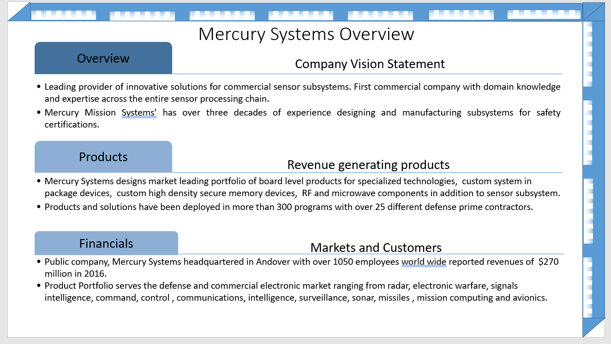
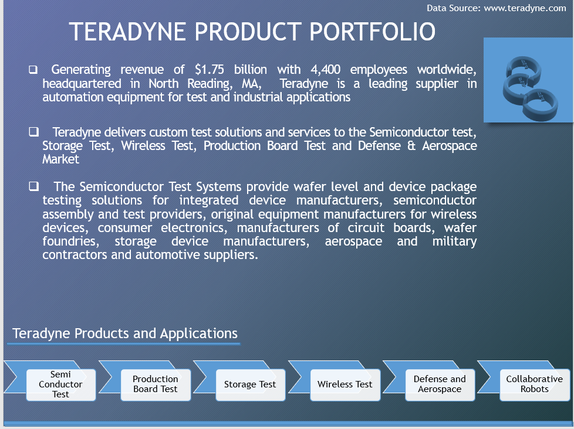

# Introduction To Machine Language Programming

The project is an introduction to machine language programmming.  
Reference the program.cs for details. Reference: "How to Program C++/C# with Deitel".

/*  Introduction to Machine Language Programming 

 Simple Sum of Variables

 Address 0 Data 100734 
 
 Address 1 Data 100856
 
 Address 2 Data 200700
 
 Address 3 Data 300800
 
 Address 4 Data 210900
 
 Address 5 Data 110900
 
 Address 6 Data 420000
 
 Address 7 Data 000034
 
 Address 8 Data 000056
 
 Address 9 Data 000090
 
Display Variable is 90

 Branching with Variables, display variable is the largest data integer

 Address 0 Data 100975
 
 Address 1 Data 101076
 
 Address 2 Data 200900
 
 Address 3 Data 311000
 
 Address 4 Data 410700
 
 Address 5 Data 110900
 
 Address 6 Data 420000
 
 Address 7 Data 111000
 
 Address 8 Data 420000
 
 Address 9 Data 000075
 
 Address 10 Data 000076
 
Display Variable is 76

    */
    
## Algorithms
  
    
 ## Ethics and Integrity
  
  
 ## Interest
    
 
 
    
Additional details : https://github.com/alpaddesai/DigitalLogicHDL and https://github.com/alpaddesai/HardwareEngineeringLab4-
